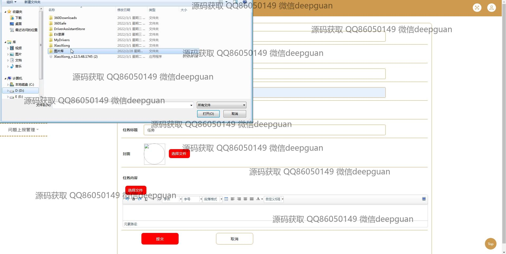
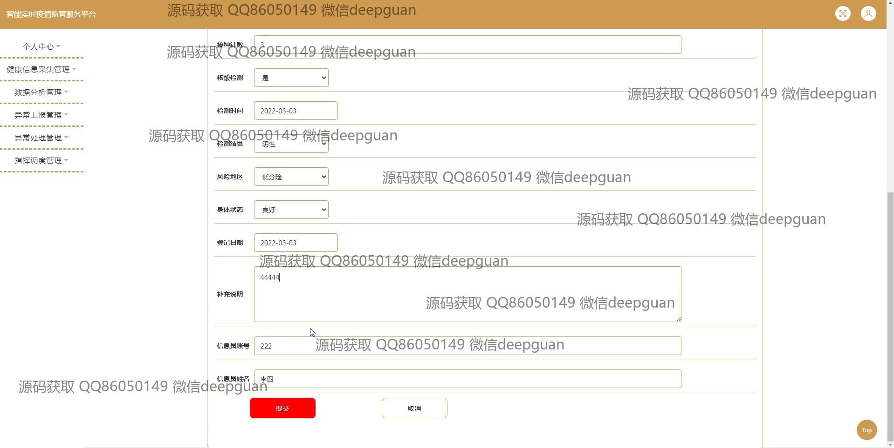
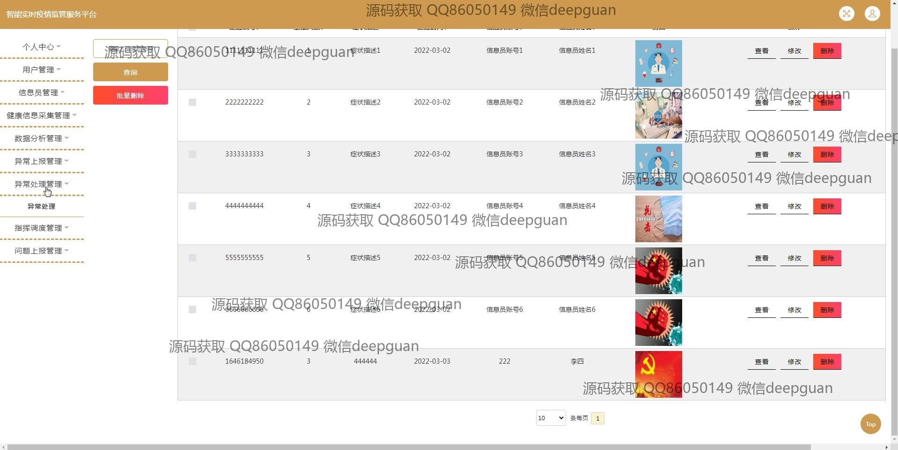

<h1 align="center">基于JavaEE的智能实时疫情监管服务平台的设计与实现+jsp</h1>

## 简介
智能实时疫情监管服务平台：角色分为管理员、用户；提供用户管理、信息采集管理、健康信息分析、异常上报管理、指挥调度管理等功能，实现高效的疫情数据监控与处理。    --计算机毕业设计源码；毕设源码；java毕业设计源码

## 联系方式

<h3 align="center">获取完整代码与数据库文件 + 微信：deepguan QQ: 86050149 QQ群: 783742310</h3>

<h3 align="center">可帮忙远程部署 包运行成功！提供远程部署、修改代码、设计文档指导、代码讲解等服务！</h3>

## 功能介绍（完整见运行截图）
管理员：具备用户管理、信息员管理、健康信息采集管理、数据分析管理、异常上报与处理管理、指挥调度管理等功能，可对用户和信息进行查询、添加、修改、删除及批量删除操作。监督疫情数据上传和异常报告审核，通过个人中心和主页导航快速访问平台功能。

信息员：负责健康信息采集，异常上报和处理。可以查看、录入和修改疫情数据，上传相关文件和描述症状等信息。管理个人账户信息，通过注册登录后访问对应的管理模块，确保信息数据的准确性和时效性。

普通用户：可以注册和登录平台，查看个人健康档案、疫苗接种记录、核酸检测结果等信息。用户通过个人中心和菜单导航，进行健康数据的录入、个人信息的更新及管理，并上传相关疫情数据，提升数据处理效率。

开发者：设计简洁直观的用户界面，包括个性化注册、数据分析、问题上报、导航菜单等模块，实现疫情数据的实时监管和系统运行的智能化。通过JSP技术实现模块化的功能设计，支持多终端的数据同步和疫情信息的高效处理。

## 运行截图

本代码来源于网络,仅供学习参考使用!

